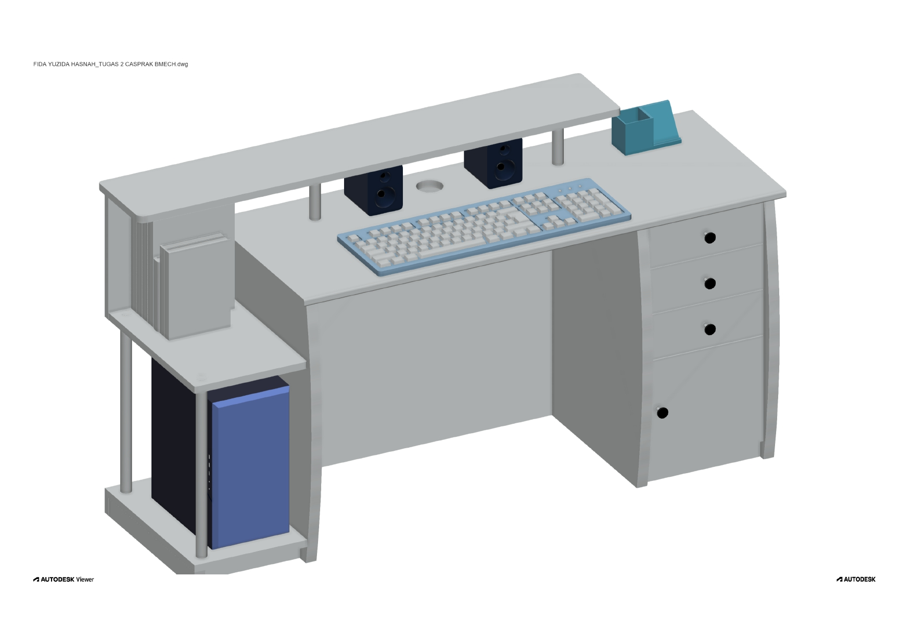

# Computer Desk Design (3D Model)

A 3D model of a computer desk designed using AutoCAD.  
The design includes the main desk, drawers, CPU holder, bookshelf, keyboard, and speaker components.  
This project was created as an exercise in assembly modeling and workspace layout design.  

