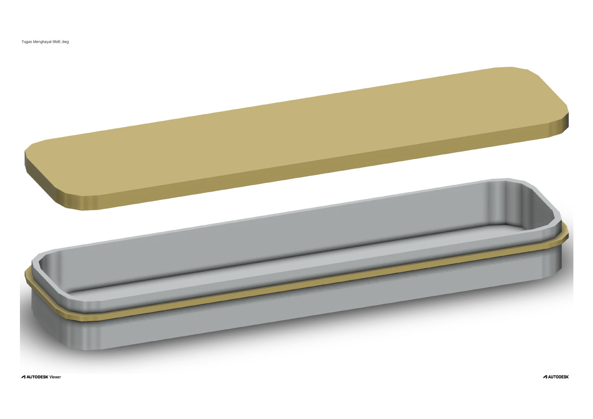

# 3D Product Design – Cutlery Container (Lunch Box)

A 3D model of a cutlery container (lunch box) created using AutoCAD.  
The model consists of two main parts: the main container and the lid with a sealing layer to keep it airtight and hygienic.  
The design is inspired by portable lunch boxes used to carry spoons, forks, and chopsticks. 
