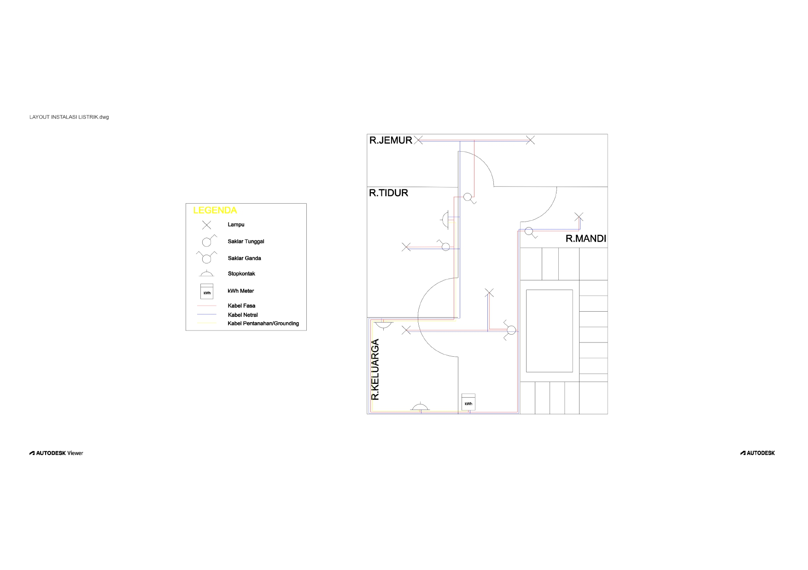

# Modul 2 - Layout Instalasi Listrik (2D Drawing)

2D layout of a basic home electrical installation created in AutoCAD.  
Includes lamp, switch, outlet, and wiring routes for phase, neutral, and grounding cables.
