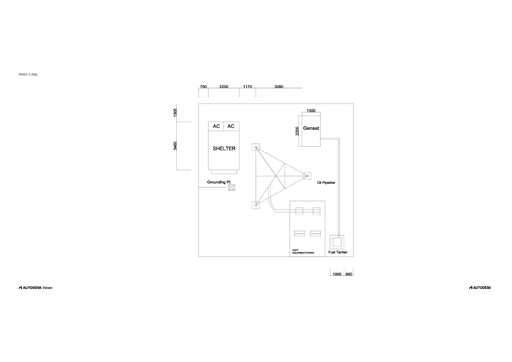

# Modul 3 - Layout Sistem Grounding (2D Drawing)

2D layout of a grounding system created in AutoCAD.  
Shows grounding points connected to genset, shelter, fuel tank, and other equipment to ensure electrical safety.
