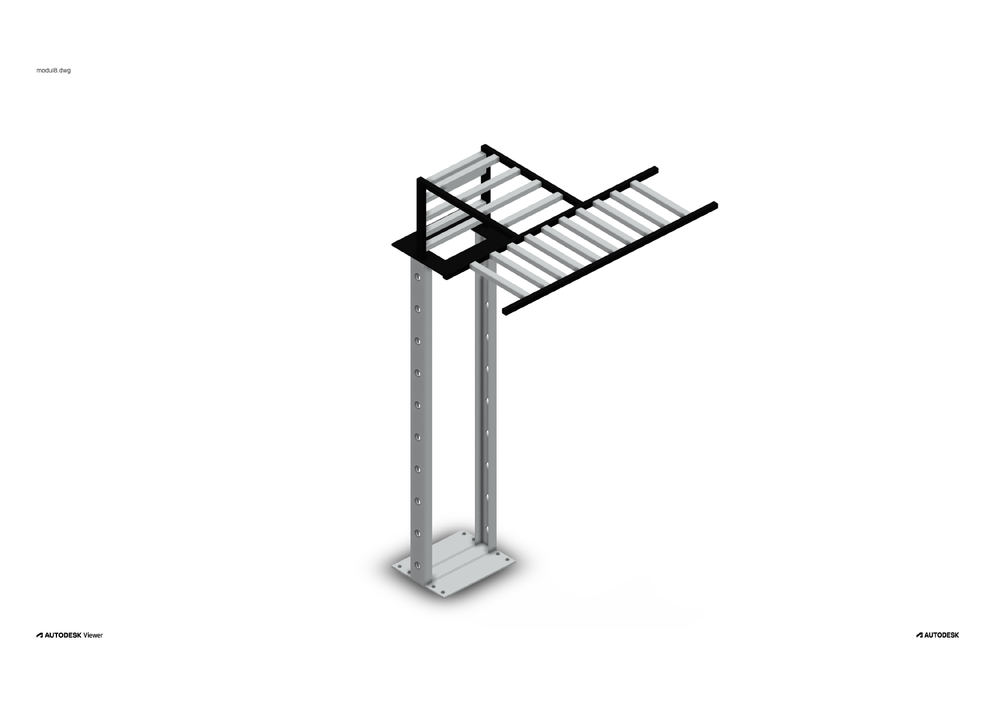

# Modul 6 - Panel Casing (3D Model)

3D model of an industrial panel casing and cable tray support structure created in AutoCAD.  
Includes vertical column, base plate, and top frame for cable routing design practice.
